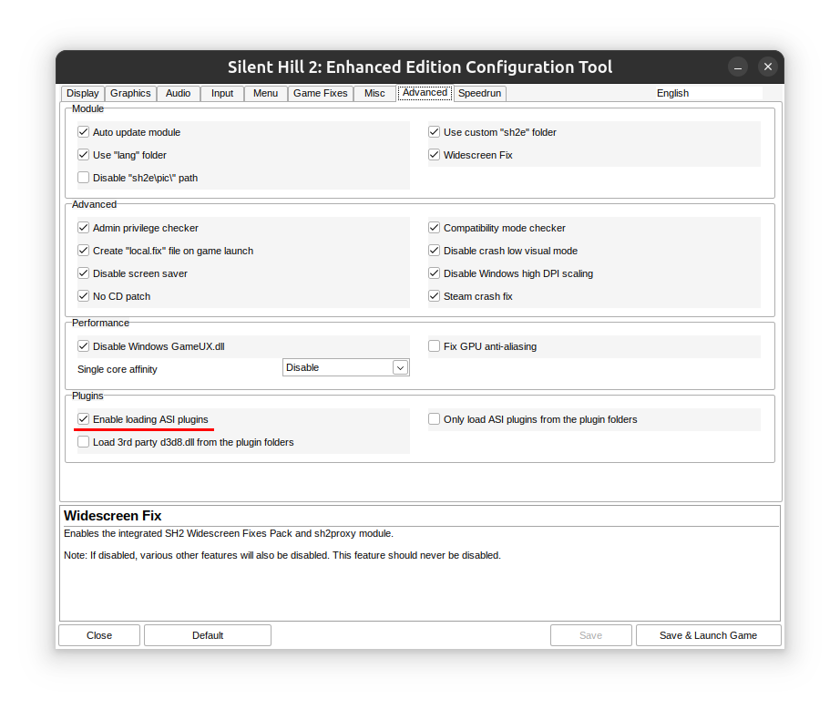
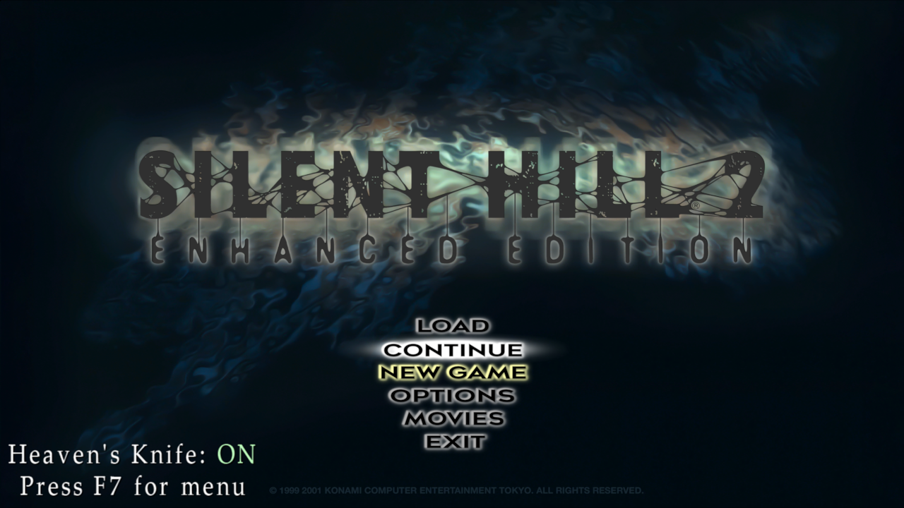
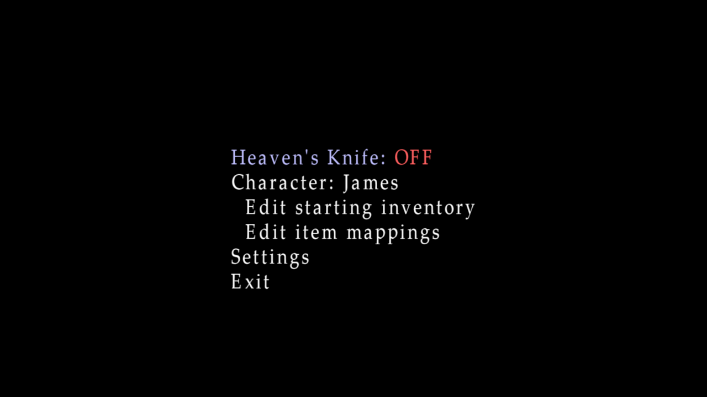
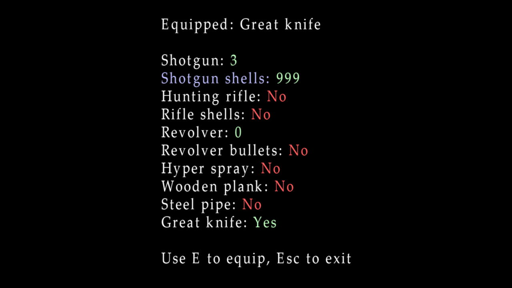
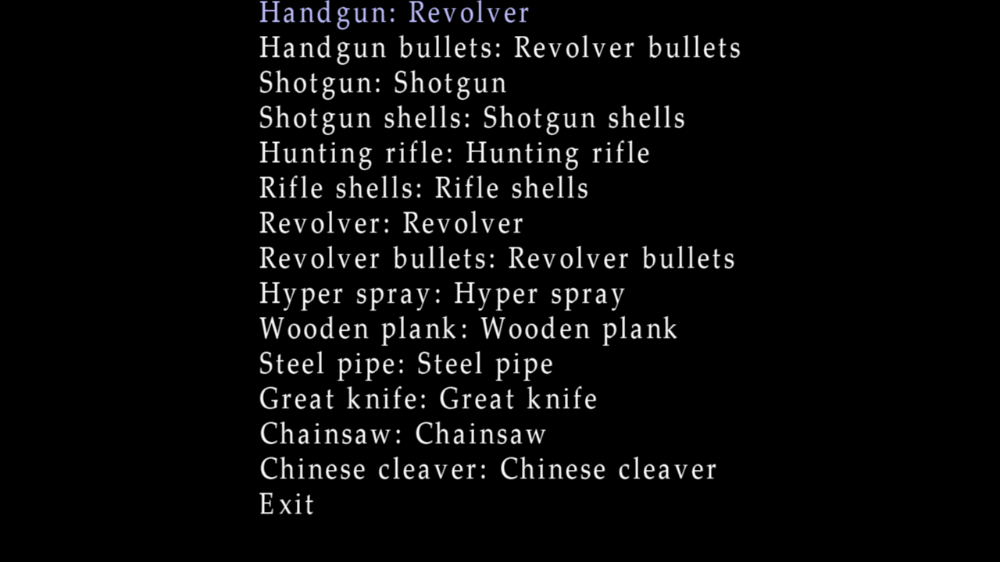
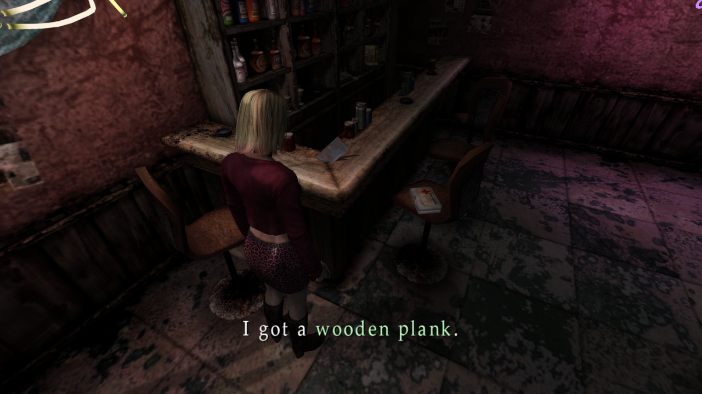
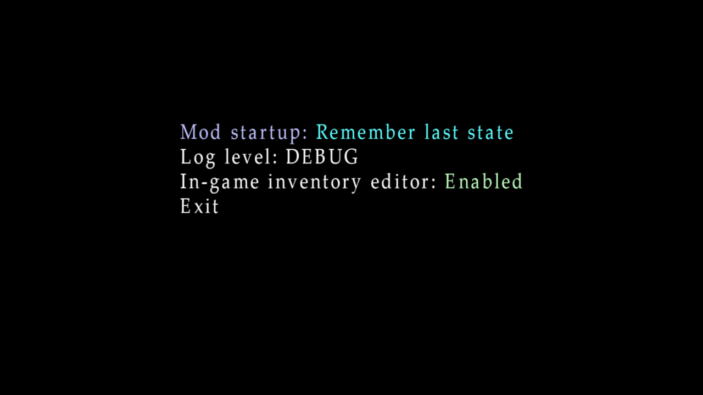

# Heaven's Knife

A mod for Silent Hill 2: Enhanced Edition that allows James and Maria to use each other's weapons.

## Install

This mod requires [Silent Hill 2: Enhanced Edition](https://enhanced.townofsilenthill.com/SH2/). You should have the
game and Enhanced Edition already installed before you proceed.

1. Grab a release from the Nexus or the [Releases](https://github.com/descawed/sh2-heavens-knife/releases) section on
   the right.
2. Extract the contents of the zip file to your Silent Hill 2 folder. Make sure you extract *directly* into the Silent
   Hill 2 folder and not into a new folder inside that folder. If you did it correctly, you should have a file called
   knife.asi in the same folder as sh2pc.exe.
3. Open the Silent Hill 2: Enhanced Edition Configuration Tool (SH2EEconfig.exe), go to the Advanced tab, and check the
   box labeled "Enable loading ASI plugins" (this only needs to be done once; the setting will be saved once you click
   "Save" or "Save & Launch Game").

   
4. If everything has been done correctly, the next time you launch the game, you'll see a message from the mod in the
   bottom left corner of the main menu. By default, the mod will be loaded but turned off. You can enable it and change
   settings from the [configuration menu](#Configuration).
  
   

## Uninstall

Double-click the knife_uninstall.bat file that comes with the mod to uninstall. Once you confirm that you want to
uninstall, it should delete every file from the mod, including itself.

## How to Use

The core feature of the mod is allowing James and Maria to use each other's items, specifically weapons (while the mod
does allow you to get key items from the other scenario, they don't have any function). This feature is always active
as long as the mod is loaded, even when it reports being "OFF". However, while the mod is off, there's no way to
actually get any of these items into your inventory (unless you're using another mod or an external program like
Cheat Engine). The secondary features of the mod - which are what the on/off toggle refers to - are designed to give
you some options for getting these items into your inventory. There are three main controls for getting access to these
items:

- **Edit starting inventory** - This allows you to change what items the player starts with when starting a new game.
- **Edit inventory** - This replaces the above option while in-game and allows you to edit your current inventory in
  real time. This feature can be disabled if it feels too cheat-y.
- **Edit item mappings** - This allows you to map/replace pickups of one type of item with another. It only supports
  weapon and ammo items. For example, if playing the main scenario, you could map the handgun to the revolver and map
  handgun bullets to revolver bullets. Then, when you picked up the handgun in the apartments, you would get the
  revolver instead, and every handgun ammo pickup in the game would give you revolver ammo instead. This would let you
  play through the main scenario with Maria's revolver instead of the normal handgun.

These settings can be controlled through the in-game configuration menu.

### Configuration

All the mod configuration is saved in the file knife.toml that comes with the mod. While you can edit this file by hand
if you want, there's also an in-game configuration menu that can be accessed from the main menu or, once in-game, from
the pause menu. As seen in the screenshot in the [Install](#Install) section, the mod will display a status message on
these menus, and you can press F7 to enter the configuration menu.

**Note**: To keep the code simple, the configuration menu can only be controlled by keyboard, not mouse or controller,
and the keys are not rebindable. I apologize for any inconvenience.

Upon pressing F7, you'll be greeted by a menu like this:

You can navigate the menus with WASD or the arrow keys - up and down move through the options, and left and right cycle
through the different settings for a particular option where appropriate. Space or enter will activate an option or
toggle on/off settings. Esc will return to the previous menu, and F7 will immediately return you to the main menu or
pause menu (whichever you started from).

With that out of the way, the main configuration menu has the following options:

- **Heaven's Knife** - This is the on/off toggle for the mod. The starting inventory and item mapping settings will have
  no effect unless this is turned on.
- **Character** - The mod keeps separate starting inventory and item mapping settings for James and Maria. This option
  controls which character's settings the two options below will edit. This option only appears when you're accessing
  the configuration from the main menu - once you're in-game, you can only edit settings for the active character.
- **Edit starting inventory** - This allows you to edit what items the player will start with when starting a new game.
  I originally created this mod with great-knife-only challenge runs in mind (hence the name), so the default
  configuration, if you toggle the mod on and don't touch anything else, will start you with the great knife. However,
  you can edit this to any set of items you want. Starting inventory can only be edited from the main menu. Once in
  game, this option will be replaced with just "Edit inventory", which will allow you to edit your current inventory
  in real time (unless you've disabled that feature; see [Settings](#Settings)). For more details about this menu, see
  [Inventory](#Inventory).
- **Edit item mappings** - This allows you to replace weapon and ammo pickups with pickups of different weapons and
  ammo. The main goal of this feature is to allow you to obtain the alternate weapons and ammo through gameplay instead
  of directly inserting them into your inventory. See the [Mappings](#Mappings) section for details.
- **Settings** - This menu has a few different settings that control how the mod operates. See [Settings](#Settings)
  for details.
- **Exit** - This option exits the configuration menu.

More details explanations of the various sub-menus follow below.

### Inventory

The inventory editor allows you to edit which items the player starts the game with (when accessed from the main menu)
or the items the player currently has in their inventory (when accessed in-game). It looks like this:

The middle section has a list of every item in the game, which you can scroll through using up/W and down/S. Left/A and
right/D will respectively decrease or increase the amount of that item you have in the inventory. For the large majority
of items that don't have a count, this just toggles between "No", the item is not in the inventory, and "Yes", the item
is in the inventory. For health items and ammo, having zero of them is the same as not having them at all, so decreasing
the count to zero will remove them from the inventory. For weapons, it's valid to have a count of zero; it means that
you have the weapon but there are no bullets in it. So for weapons, "No" and "0" are separate states.

At the top of the screen, you can see the equipped weapon. You can press E to set the currently selected weapon as the
equipped weapon. Pressing E on the weapon that's already equipped, or on an item that's not equippable, will clear the
equipped weapon.

**Note**: Adding items to your inventory via the in-game inventory editor does not update the number of items you've
picked up or set flags related to NG+ items, which may affect your end-game ranking and possibly other things I'm not
aware of.

### Mappings

The item mappings menu allows you to replace weapon and ammo pickups with pickups of different weapons and ammo. Here's
what that looks like:

By default, each item is mapped to itself, meaning everything works as normal. However, using the left and right keys,
you can cycle between replacing the selected item with one of the other weapon and ammo items. For example, in the
screenshot above, I've mapped the handgun to the revolver and handgun bullets to revolver bullets. This means that
picking up the handgun will give me the revolver and picking up handgun bullets will give me revolver bullets - in
other words, this basically replaces the handgun with the revolver in James' scenario.

It's also possible to map an item to nothing, effectively disabling pickups of that item. This is a little janky at the
moment - the message saying you picked up the original item will still pop, and this will result in you getting a blank
space in your inventory instead of the actual item. I hope to improve this in the future.

**Note**: Be aware that the actual 3D model of the item in the world will not change. However, when you pick them item
up, you will still get the mapped item you selected instead of the item you see, and the message will reflect that.
For example, here's a screenshot from where I mapped the cleaver to the wooden plank. We still see the cleaver on the
bar, but when I pick it up, the message correctly tells me that I've received the wooden plank, and that's what goes in
my inventory.

Also note that I haven't bothered to prevent mapping ammo items to weapons, meaning you can use this to get multiple
pickups of the same weapon. For melee weapons, this is harmless but pointless. For guns, this will add to the number of
bullets loaded in the gun beyond the normal maximum, which may have interesting and/or amusing applications.

### Settings

The settings menu contains a few settings pertaining to the operation of the mod. You can see these options here:

The options work as follows:

- **Mod startup**: This controls whether the mod is on or off when the game starts up. This can be one of the following
  values:
  - *On by default* - The mod will be on when the game starts up, but can be turned off from the configuration menu.
  - *Remember last state* - The mod will be on when the game starts up if you last had it turned on, and off if you last
    had it turned off.
  - *Off by default* - The mod will be off when the game starts up, but can be turned on from the configuration menu.
  - *Disabled* - The mod will be completely disabled - even the configuration menu and core features will be disabled.
    This is a way to make sure the mod is not affecting the game at all without uninstalling. Note that because this
    disables the configuration menu, you'll have to edit the knife.toml configuration file by hand when you're ready to
    re-enable the mod.
- **Log level**: This controls how much detail is written to the mod's log file, knife.log. The options, from most to
  least verbose, are TRACE, DEBUG, INFO, WARN, ERROR, and OFF. For most purposes, I would recommend leaving this at the
  default of INFO.
- **In-game inventory editor**: This controls whether the inventory editor feature is enabled in-game. You can disable
  this option if you feel that the ability to arbitrarily edit your inventory at any time is too much of a cheat. When
  this setting is disabled, it can't be re-enabled while in-game; you'll have to return to the main menu if you want to
  turn it back on. Note that this setting doesn't affect the starting inventory editor; that's always available from
  the main menu prior to starting a new game.
- **Show status message**: This controls whether the status message showing whether the mod is turned on or off is
  displayed at the bottom of the screen in the main menu and pause menu. The default is "Always", meaning the message
  is always displayed. "Only when on" displays the message when the mod is turned on and hides it when the mod is
  turned off. "Never" never displays the message. Note that you can still use F7 from the main menu or pause menu to
  access the mod configuration menu even when the message is hidden.

## Build

This is a DLL-based mod written in Rust. SH2 is a 32-bit game, so you'll need a 32-bit target installed. I'm on Linux,
so I'm cross-compiling using i686-pc-windows-gnu, but I'm sure i686-pc-windows-msvc would work as well. Assuming you
have Cargo and the appropriate target installed, it should just be a matter of e.g.
`cargo build --target=i686-pc-windows-gnu`.

The release package also comes with data files - a texture and several animations. The texture is for inventory icons.
The game has separate icon textures for the two scenarios - data/pic/etc/itemmenu2.tex for the main scenario and
data/pic/add/itemmenu.tex for Maria. I used [sh2tex](https://github.com/iOrange/sh2tex) to extract these, made one big
texture with every icon, and then used sh2tex again to convert it back to the game format.

For the animations, all of the weapon animations had to be converted to fit the skeleton of the other character. I wrote
[this tool](https://github.com/descawed/sh2-anim-converter) to do that conversion - see that repo for the details of
how that process works.

## Credits

Thanks to the following people for the tools I used to make this mod:

- [Silent Hill 2: Enhanced Edition](https://enhanced.townofsilenthill.com/SH2/): Makes the game work on modern systems
  and provides the framework for loading mods like this.
- [sh2tex](https://github.com/iOrange/sh2tex): Very helpful tool which I used to create the icon texture that combines
  the icons from both scenarios.
- [Silent Hill Museum](https://silenthillmuseum.org/): I honestly don't know if I would've ever gotten the animations
  working without this fantastic resource. Being able to visualize and compare the character skeletons, as well as
  having the model file layout easily available, was really invaluable.